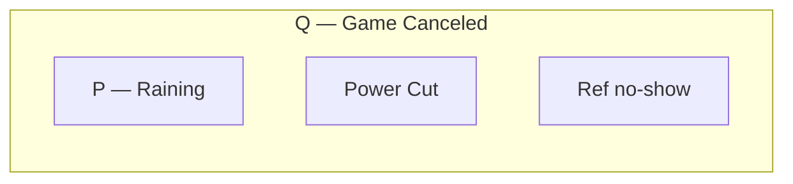
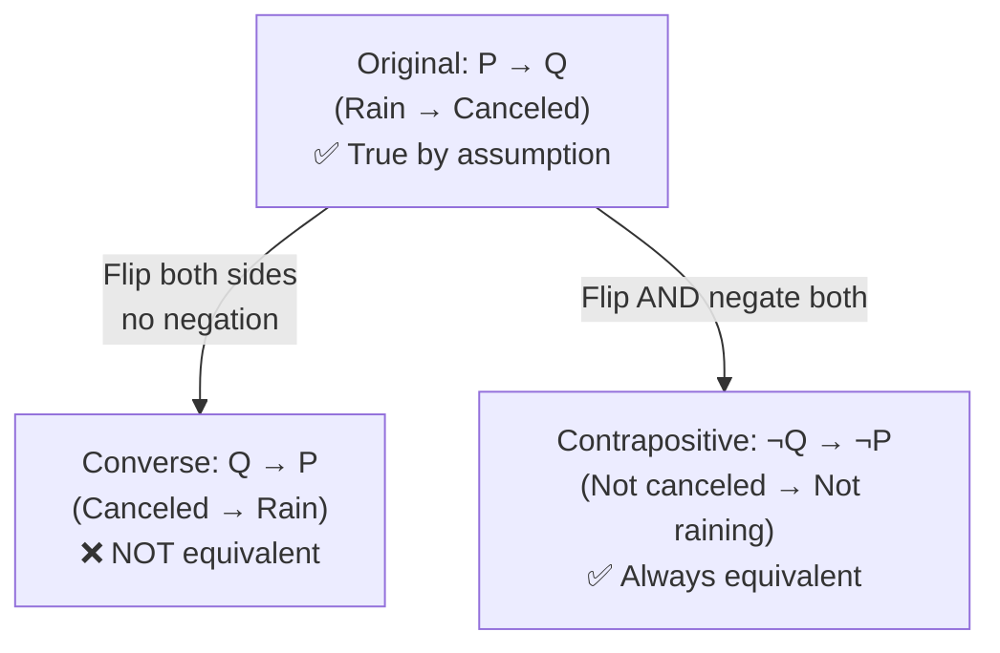
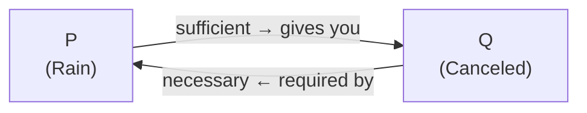

# Section 1.5 — Conditional and Biconditional Connectives

## The one-line summary

$P \to Q$ is a **promise**. It is only broken — only **False** — when $P$ happens but $Q$ does not.

---

## Part 1: The Conditional $P \to Q$

### Why think of it as a promise

The phrase "if P then Q" in logic does not mean "P causes Q". It means:

> Whenever P is true, Q is guaranteed to be true.

It is a binding contract. The only way the contract is broken is if P was true (the condition was triggered) and Q was false (the guarantee was not delivered).

### Truth table

| $P$ | $Q$ | $P \to Q$ | Plain English |
|:---:|:---:|:---:|---|
| T | T | **T** | Promise triggered and kept |
| T | F | **F** | Promise triggered and broken — the only False row |
| F | T | **T** | Promise never triggered, Q happened anyway — no violation |
| F | F | **T** | Promise never triggered, nothing happened — no violation |

> The gate analogy: when $P$ is False, the "if-then gate" is switched off. The promise was never invoked, so it cannot be broken. $Q$ can do whatever it wants.

### Concrete example: the test promise

> "If you score 100% (P), I will give you R100 (Q)."

- You score 100%, I give you R100 → **True**. Promise kept.
- You score 100%, I give you nothing → **False**. Promise broken.
- You fail, I give you nothing → **True**. I only promised what would happen if you passed. Failing triggers no obligation.
- You fail, I give you R100 anyway → **True**. I was generous, but I never said I wouldn't be. My original statement is intact.

### Why this matters for mathematics

A theorem like *"If $x > 2$ then $x^2 > 4$"* is meant to be a universal claim.

When we test $x = -5$:
- Premise: $-5 > 2$ is **False**.
- Conclusion: $(-5)^2 = 25 > 4$ is **True**.

Did $x = -5$ break the theorem? **No.** The theorem only claims something about numbers greater than 2. The value $-5$ is outside the scope of the promise, so the theorem survives — it evaluates as **True** for $x = -5$.

---

## Part 2: The three key equivalences

These three ways of writing the same promise come up constantly in proofs.

### Equivalence 1: $P \to Q \equiv \lnot P \lor Q$

> "If you neglect your homework, you will fail."
> 
> Restated: "Don't neglect your homework, or you will fail."

The only way $\lnot P \lor Q$ is False is if both $\lnot P$ is False (meaning P is True) and $Q$ is False. That matches exactly the one False row of $P \to Q$.

**Memory hook:** "Either the condition didn't fire, or the guarantee was delivered."

### Equivalence 2: $\lnot P \to Q \equiv P \lor Q$

This comes from substituting $\lnot P$ into Equivalence 1:

$$\lnot P \to Q \equiv \lnot(\lnot P) \lor Q \equiv P \lor Q$$

> "Either John went to the store, or we're out of eggs."
>
> Restated: "If John didn't go to the store, then we're out of eggs."

Both say the same thing.

### Equivalence 3: $P \to Q \equiv \lnot(P \land \lnot Q)$

> "If it's raining, I'll take my umbrella."
>
> Restated: "It will never be the case that it's raining AND I don't have my umbrella."

The conditional says you cannot have the premise true and the conclusion false at the same time. So it is logically identical to saying that $P \land \lnot Q$ is impossible.

**Memory hook:** "You can never catch me with the trigger pulled and the guarantee missing."

### Summary table

| Equivalent form | Plain reading |
|---|---|
| $P \to Q$ | If P then Q |
| $\lnot P \lor Q$ | Either not-P, or Q |
| $\lnot(P \land \lnot Q)$ | Never P without Q |

---

## Part 3: Converse and Contrapositive

This is where most people get confused. Here is the visual that makes it click.

### The box diagram

$P \to Q$ means: the P situation is completely contained inside the Q situation.

```
┌─────────────────────────────────────┐
│             Q (e.g. "Game canceled")│
│                                     │
│   ┌──────────┐   ┌──────────────┐   │
│   │  P       │   │  Power cut   │   │
│   │ (Rain)   │   │              │   │
│   └──────────┘   └──────────────┘   │
│                                     │
└─────────────────────────────────────┘
```

If it is raining (inside P box), you are automatically inside the Q box (game canceled).
But being inside Q does not tell you which sub-box you are in.



### The three directions



### Why the converse fails

> Original: "If I am in Cape Town, then I am in South Africa." ✅
> 
> Converse: "If I am in South Africa, then I am in Cape Town." ❌

You could be in Johannesburg, Durban, or Kruger. Being in the large container (South Africa) does not tell you which city you are in.

Knowing Q is true does not tell you P was the reason. There may be other boxes inside Q.

### Why the contrapositive works

> Contrapositive: "If I am not in South Africa, then I am not in Cape Town." ✅

If you are standing in Brazil, you are outside the outer box entirely. Cape Town is inside the outer box. So you cannot possibly be in Cape Town. This is airtight.

**Rule to remember:**

| | Swap directions? | Negate both? | Equivalent to original? |
|---|:---:|:---:|:---:|
| Converse $Q \to P$ | ✅ | ❌ | **No** |
| Contrapositive $\lnot Q \to \lnot P$ | ✅ | ✅ | **Yes** |
| Inverse $\lnot P \to \lnot Q$ | ❌ | ✅ | **No** |

> Mnemonic: **Only the contrapositive (flip AND negate) is always equivalent.**

---

## Part 4: All the ways English says $P \to Q$

These five phrasings all mean exactly $P \to Q$. They come up constantly in proofs.

| English phrasing | Example | How to see it is $P \to Q$ |
|---|---|---|
| If P then Q | If it rains, the game is canceled | Direct |
| Q if P | The game is canceled if it rains | Just rearranged |
| P only if Q | You can run for president only if you are a citizen | "Only if" means: if you're not a citizen, you can't run → $\lnot Q \to \lnot P$ → contrapositive of $P \to Q$ |
| P is a sufficient condition for Q | Rain is sufficient for cancellation | P alone is enough to guarantee Q |
| Q is a necessary condition for P | Citizenship is necessary to run | Without Q, P cannot happen: $\lnot Q \to \lnot P$ → $P \to Q$ |

### The "only if" trap

> "You can run for president **only if** you are a citizen."

This does **not** say becoming a citizen lets you run. It says that if you try to run and you are not a citizen, that is impossible. So: $\lnot Q \to \lnot P$, which is the contrapositive of $P \to Q$.

The phrase **"only if"** always points to the conclusion ($Q$), not the premise.

### Sufficient vs necessary (visual)

```
Sufficient (P is sufficient for Q):
  Knowing P is enough → you get Q for free.

Necessary (Q is necessary for P):
  You must have Q just to have P.
  Q is the floor. No Q means no P.
```



Both arrows describe the same $P \to Q$ relationship from opposite perspectives.

---

## Part 5: The Biconditional $P \leftrightarrow Q$

### What it means

A biconditional is just **two conditionals bolted together**:

$$P \leftrightarrow Q \equiv (P \to Q) \land (Q \to P)$$

It says: not only does P guarantee Q, but Q also guarantees P. They lock each other in.

### Truth table

| $P$ | $Q$ | $P \to Q$ | $Q \to P$ | $P \leftrightarrow Q$ |
|:---:|:---:|:---:|:---:|:---:|
| T | T | T | T | **T** |
| T | F | F | T | **F** |
| F | T | T | F | **F** |
| F | F | T | T | **T** |

> $P \leftrightarrow Q$ is True exactly when $P$ and $Q$ have the same truth value — both true or both false.

### The box diagram for biconditionals

In the conditional, P was a small box inside the larger Q box. In the biconditional, P and Q are exactly the same box.

```
Conditional P → Q:          Biconditional P ↔ Q:
┌────────────────────┐       ┌───────────────────────┐
│        Q           │       │                       │
│   ┌────────┐       │       │   ┌──────────────┐    │
│   │   P    │       │       │   │   P  =  Q    │    │
│   └────────┘       │       │   └──────────────┘    │
└────────────────────┘       └───────────────────────┘
```

### English ways to say $P \leftrightarrow Q$

| Phrasing | Meaning |
|---|---|
| P if and only if Q | Standard mathematical phrasing |
| P iff Q | Abbreviation of "if and only if" |
| P is a necessary and sufficient condition for Q | Combines both directions |

### The everyday speech trap

> Parent: "If you don't eat your dinner, you won't get dessert."

The child hears this as a biconditional: "If I eat my dinner, I will get dessert." But the parent only stated a conditional. The converse was never said.

In everyday speech this blurring is normal. In **mathematics it is never acceptable**. Always use "iff" or "necessary and sufficient" when both directions hold. Using only "if" means only one direction.

---

## Part 6: Analysing example statements (worked)

### Weather example (from the book)

Abbreviations: R = "It's raining", S = "It's snowing", C = "Game canceled".

| Statement | Logical form | Relationship |
|---|---|---|
| If raining or snowing, game canceled | $(R \lor S) \to C$ | Original |
| If not canceled, not raining and not snowing | $\lnot C \to (\lnot R \land \lnot S)$ | Contrapositive (equivalent) |
| If game canceled, then raining or snowing | $C \to (R \lor S)$ | Converse (not equivalent) |
| If raining then canceled, and if snowing then canceled | $(R \to C) \land (S \to C)$ | Equivalent to original |
| If neither raining nor snowing, game not canceled | $\lnot(R \lor S) \to \lnot C$ | Contrapositive of the converse (not equivalent to original) |

### Lecture example (from the book)

Abbreviations: T = "At least ten people are there", L = "Lecture will be given".

| Statement | Logical form | Notes |
|---|---|---|
| If at least ten people, lecture given | $T \to L$ | Direct conditional |
| Lecture given **only if** at least ten people | $L \to T$ | "Only if" flips to the other direction |
| Lecture given **if** at least ten people | $T \to L$ | "If" gives the premise |
| Ten people is **sufficient** for the lecture | $T \to L$ | Ten people alone guarantees it |
| Ten people is **necessary** for the lecture | $L \to T$ | Can't have lecture without ten people |

---

## Quick reference card

```
┌─────────────────────────────────────────────────────────────┐
│                    CONDITIONAL  P → Q                       │
│                                                             │
│  Only False when: P is True AND Q is False                  │
│  The promise is only broken when triggered and not kept.    │
│                                                             │
│  Equivalents:                                               │
│    ¬P ∨ Q        (either no trigger, or guarantee)         │
│    ¬(P ∧ ¬Q)     (never trigger without guarantee)         │
│                                                             │
│  Same direction, negate both = CONTRAPOSITIVE ✅ equivalent │
│  Flip direction only           = CONVERSE      ❌ different  │
│                                                             │
│  English synonyms for P → Q:                                │
│    "Q if P"                                                 │
│    "P only if Q"                                            │
│    "P is sufficient for Q"                                  │
│    "Q is necessary for P"                                   │
├─────────────────────────────────────────────────────────────┤
│                  BICONDITIONAL  P ↔ Q                       │
│                                                             │
│  True when P and Q have the same truth value.               │
│  Means: (P → Q) AND (Q → P)                                 │
│  English: "P if and only if Q", "P iff Q"                   │
│           "P is necessary and sufficient for Q"             │
│                                                             │
│  In math: always write "iff" when you mean both directions. │
│  "If" alone never implies the converse.                     │
└─────────────────────────────────────────────────────────────┘
```
